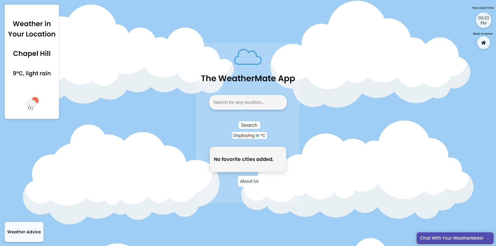

# The WeatherMate App

Welcome to WeatherMate! Created by [Son Nguyen](https://github.com/hoangsonww) in 2024, WeatherMate is your go-to web application for staying updated with the latest weather conditions for any location! With an easy-to-use interface and real-time data, WeatherMate ensures that you're well-prepared for the weather ahead. The mobile version is also under development, and is in the `WeatherMate-Mobile` subdirectory.

At the mean time, you can use the web version [here](https://hoangsonww.github.io/WeatherMate-App/). Let's get prepared for the weather ahead 🌤️️!

## User Interface

<p align="center" style="cursor: pointer">
  <a href="https://hoangsonww.github.io/WeatherMate-App/">
    
  </a>
</p>

## Features

- **Current Weather Conditions**: Get detailed reports of the current weather, including temperature, weather conditions, and more.
- **Local Time Display**: Shows the exact local time at the searched location.
- **Air Quality Index (AQI)**: Stay informed about the air quality of your chosen location with the AQI feature.
- **Humidity and Rain Forecast**: Understand the chance of precipitation and humidity levels with just a click.
- **Dynamic Backgrounds**: The UI changes to reflect the current weather conditions, enhancing the user experience.
- **Favorites**: Save your favorite locations for quick weather checks.
- **Responsive Design**: WeatherMate looks great on any device, whether it's your phone, tablet, or desktop.
- **Chatbot Integration**: Get weather updates through a chatbot interface. It can also answer many other queries you may have!

## How It Works

WeatherMate fetches data from the OpenWeatherMap API and our live databases, which provides comprehensive weather data that our app processes to give you the most relevant weather information.

## Getting Started

To get started with WeatherMate:

1. **Clone the Repository**
   ```bash
   git clone https://github.com/hoangsonww/WeatherMate-App.git
   ```
   ```bash
   cd WeatherMate
   ```

2. **Install Dependencies**
   Assuming you have Node.js and npm installed, run the following command:
   ```bash
   npm install
   ```

3. **Run the Application**
   Simply open the `index.html` file in your browser to see WeatherMate in action. We're also working on a mobile version, so stay tuned for updates!

## Usage

- **Search**: Enter a city or region name in the search box and hit enter or click the search button.
- **View Weather**: The current weather will display immediately upon search.
- **View Forecast**: Click the "View Forecast" button to see the upcoming weather conditions.
- **View AQI**: Click the "View Air Quality Index" button to see the air quality data.
- **View Humidity and Rain**: Click the "View Humidity & Chance of Rain" button to get detailed humidity stats and precipitation chances.
- **Add to Favorites**: Click the heart icon next to the city name to add it to your favorites for quick access later.
- **Remove from Favorites**: Click the heart icon next to the city name to remove it from your favorites.
- **Switch Units**: Click the "Switch Units" button to toggle between Celsius and Fahrenheit.
- **Refresh**: Click the "Refresh" button to refresh the weather data.
- **Local Time**: The local time of the searched location is displayed at the top of the page.
- **Dynamic Backgrounds**: The background image changes to reflect the current weather conditions.
- **Local Advice**: The advice at the bottom of the page changes to reflect the current weather conditions.
- **Local Weather**: The weather conditions at the top right of the page changes to reflect the current weather conditions.
- **Cute Backgrounds**: The background image changes to reflect the current weather conditions.

## Technologies

- **HTML/CSS**: For structure and styling.
- **JavaScript**: For dynamic interactions and API integration.
- **Vue.js**: For reactive UI components.
- **Font Awesome**: For icons.
- **Moment.js**: For time display.
- **jQuery**: For DOM manipulation.
- **Bootstrap**: For styling and responsiveness.
- **Git**: For version control.
- **GitHub Pages**: For deployment.
- **Webpack**: For bundling.
- **Babel**: For transpiling.
- **Figma**: For design and prototyping.

## Contributing

Contributions are what make the open-source community such an amazing place to learn, inspire, and create. Any contributions you make are **greatly appreciated**.

1. Fork the Project
2. Create your Feature Branch (`git checkout -b feature/AmazingFeature`)
3. Commit your Changes (`git commit -m 'Add some AmazingFeature'`)
4. Push to the Branch (`git push origin feature/AmazingFeature`)
5. Open a Pull Request

## License

Distributed under the MIT License. See [LICENSE](../LICENSE) for more information.

## Contact

Son Nguyen - [@hoangsonww](https://github.com/hoangsonww)

Project Link: [https://github.com/hoangsonww/WeatherMate-App](https://github.com/hoangsonww/WeatherMate-App)

App's URL: [https://hoangsonww.github.io/WeatherMate-App/](https://hoangsonww.github.io/WeatherMate-App/)

---

Created with ❤️ in 2024 by [Son Nguyen](https://github.com/hoangsonww). Thank you for using WeatherMate! 🌤️
