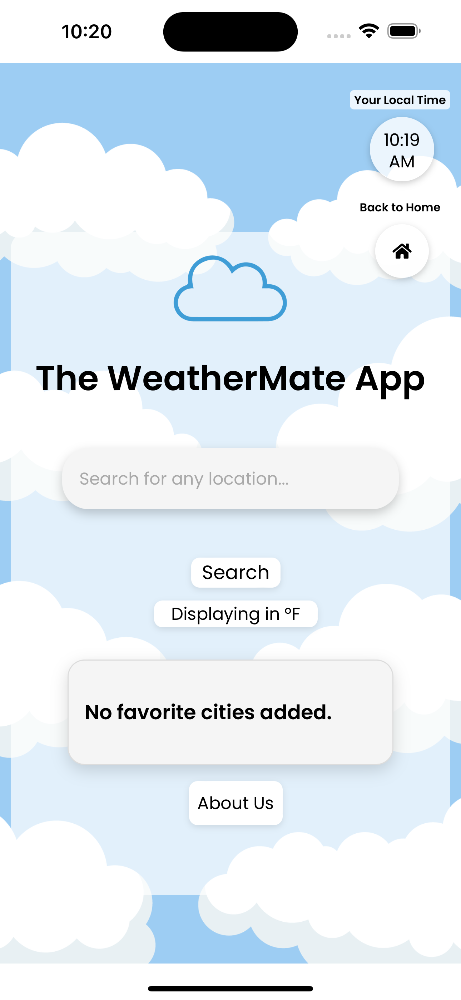
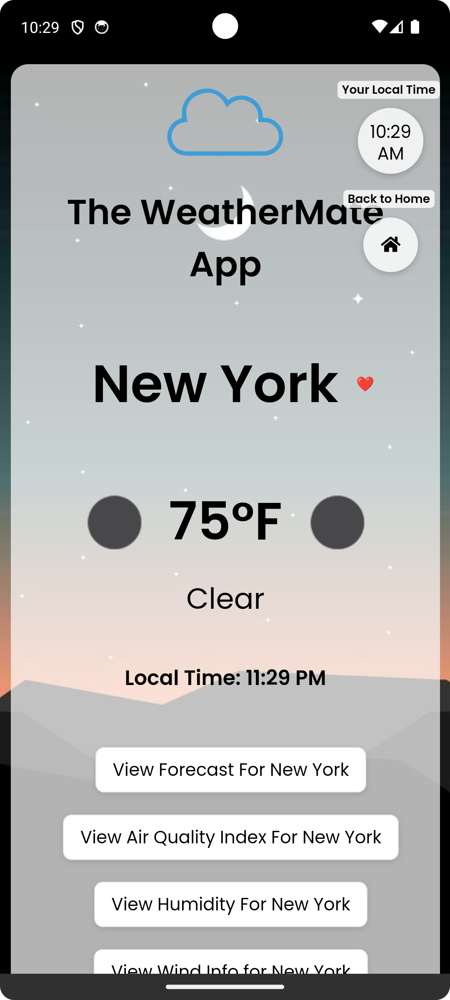

# WeatherMate Mobile App

## Introduction
WeatherMate is a comprehensive weather application providing real-time weather updates, forecasts, and air quality information. Developed using Kotlin, Swift, and React Native, WeatherMate offers a seamless experience across both Android and iOS platforms.

## Features
- **Real-time Weather Updates:** Get the latest weather information for any location.
- **Forecasts:** Access detailed weather forecasts including temperature, humidity, wind, and more.
- **Air Quality Index:** Stay informed about the air quality in your area.
- **Favorites:** Save your favorite locations for quick access to weather updates.
- **Responsive UI:** Optimized for a range of devices, providing an engaging user experience.

## Getting Started
These instructions will get you a copy of the project up and running on your local machine for development and testing purposes.

### Prerequisites
- Android Studio (for Kotlin and React Native)
- Xcode (for Swift)
- Node.js and npm (for React Native)

### Installing
1. **Clone the repository:**
   ```bash
   git clone https://github.com/hoangsonww/WeatherMate-App.git
   ```
2. **For Android:**
    - Open the project in Android Studio.
    - Run the application on an emulator or physical device.

3. **For iOS:**
    - Open the `WeatherMate.xcodeproj` file in Xcode.
    - Run the application on an iOS simulator or a physical device.
    - Note: If you change the code, you must remove the iOS platform and add it again using the following commands for the changes to take effect:
    ```bash
    cordova platforms rm ios
    cordova platforms add ios
    ```
   
### Mobile UI

If your previous installations are successful, you should see the following output:

#### iOS

<p align="center" style="cursor: pointer">
    
</p>

#### Android

<p align="center" style="cursor: pointer">
    
</p>

This image shows an example when the user views the weather for New York City.

## Built With
- [Kotlin](https://kotlinlang.org/) - Used for Android development.
- [Swift](https://swift.org/) - Used for iOS development.
- [Cordova](https://cordova.apache.org/) - Used for cross-platform development.

## Versioning
We use [Git](https://git-scm.com/) for version control.

## Authors
- **Son Nguyen Hoang** - *Initial work*

See also the list of [contributors](https://github.com/hoangsonww) who participated in this project.

## License
This project is licensed under the MIT License - see the [LICENSE.md](../LICENSE) file for details.
